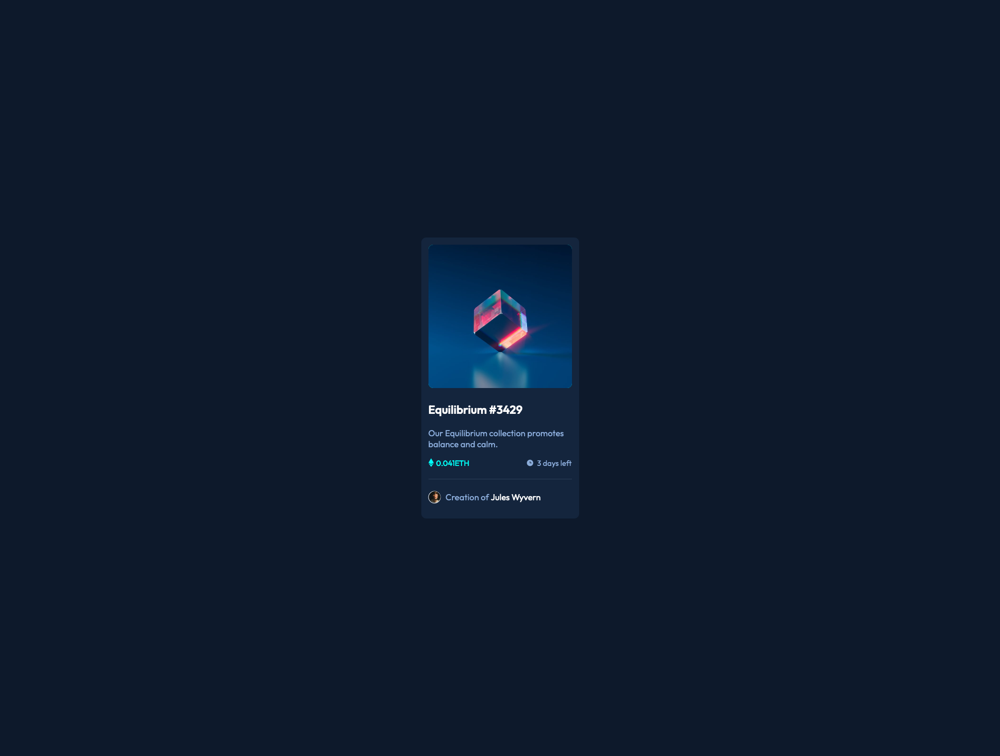

# Frontend Mentor - NFT preview card component solution


This is a solution to the [NFT preview card component challenge on Frontend Mentor](https://www.frontendmentor.io/challenges/nft-preview-card-component-SbdUL_w0U). Frontend Mentor challenges help you improve your coding skills by building realistic projects. 

## Table of contents

- [Overview](#overview)
  - [The challenge](#the-challenge)
  - [Links](#links)
- [My process](#my-process)
  - [Built with](#built-with)
  - [What I learned](#what-i-learned)
  - [Continued development](#continued-development)
  - [Useful resources](#useful-resources)
- [Author](#author)
- [Acknowledgments](#acknowledgments)

**Note: Delete this note and update the table of contents based on what sections you keep.**

## Overview

### The challenge

Users should be able to:

- View the optimal layout depending on their device's screen size
- See hover states for interactive elements

### Links

- Solution URL: [Add solution URL here](https://github.com/mscates/preview-card)
- Live Site URL: [Add live site URL here](https://musing-bartik-38046b.netlify.app/)

## My process

### Built with

- SASS
- CSS custom properties
- Flexbox
- Mobile-first workflow

### What I learned

I learned how to use mix blend mode to create an overlay.  This was much easier than my first solution.  I also worked with transitions to make the hover state react more smoothly.  I also used sass variables to make my code easier to maintain.

```html
<div class="img-container">
    
</div>
```
```css
.img-container {
  background-color: $primary2;
  height: 300px;
  border-radius: 10px;
}
.img-container img {
  max-width: 300px;
  width: 100%;
  border-radius: 10px;
}

.img-container img:hover {
  opacity: 0.6;
  mix-blend-mode: multiply;
  border-radius: 10px;
  transition: 0.5s ease;
  cursor: pointer;
}
```

### Continued development

I want to get more comfortable with the shorthand flex property.  I am not sure how to use flex grow, shrink and basis yet.  also, organizing my css code is a top priority.

## Author

- Frontend Mentor - [@yourusername](https://www.frontendmentor.io/profile/mscates)

## Acknowledgments

I received help from Grace on the Front End Mentor forum.  She assisted me with the hover overlay of the image.  


